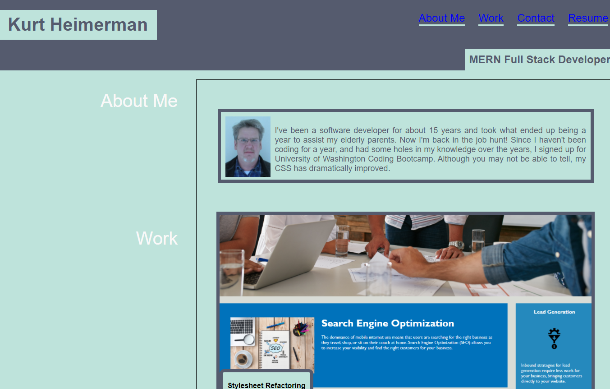

# This is Kurt Heimerman's Portfolio site.
* It is a GitHub page that links to other work I have done. 

* The Portfolio page is responsive.

* 

* It uses HTML and CSS.

* The biggest problem I faced was controlling layout of irregularly sized images.

